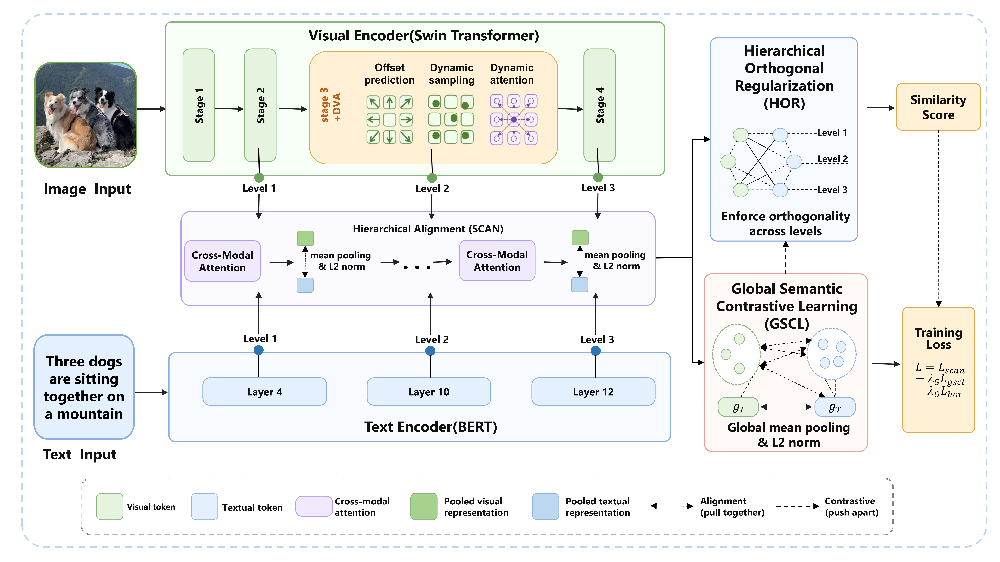

# DHOHA: Dynamic Hierarchical Orthogonal Alignment

Implementation of our paper, **"Hierarchical Image-Text Retrieval with Dynamic Visual Encoding and Orthogonal Feature Decoupling"**. This repo is built on top of [METER](https://github.com/zdou0830/METER).


## Introduction

Image-text cross-modal retrieval aims to construct a unified semantic space bridging vision and language. Existing hierarchical alignment methods still suffer from three limitations: **rigid visual region modeling**, **local matching lacking instance-level global semantic constraints**, and **cross-level representation redundancy**.

To address these issues, we propose the **Dynamic Hierarchical Orthogonal Alignment framework (DHOHA)**, comprising three core modules:

- **DVA:** Content-adaptive offset sampling that overcomes fixed-window partitioning for stronger visual semantics.
- **GSCL:** Instance-level bidirectional InfoNCE to fill the global semantic gaps left by purely local alignment.
- **HOR:** Cross-level orthogonal regularization that suppresses redundancy and drives complementary representation learning.



## Requirements

- Python 3.8
- [PyTorch](http://pytorch.org/) 1.8.1
- [NumPy](http://www.numpy.org/) >= 1.23.4
- [Transformers](https://huggingface.co/docs/transformers) 4.6.0
- [timm](https://timm.fast.ai/) 0.4.12
- [PyTorch Lightning](https://www.pytorchlightning.ai/) 1.3.2

See [requirements.txt](requirements.txt) for the full list.

## Data Preparation

The raw images can be downloaded from their original sources:

- [Flickr30K](http://shannon.cs.illinois.edu/DenotationGraph/)
- [MSCOCO](http://mscoco.org/)

Set the path to extracted files as `$DATA_PATH`.

## Training

Train DHOHA on Flickr30K:

```bash
python run.py with data_root=$DATA_PATH
```

Train DHOHA on MSCOCO:

```bash
python run.py with coco_config data_root=$DATA_PATH
```

## Testing

Test on Flickr30K:

```bash
python run.py with data_root=$DATA_PATH test_only=True checkpoint=$CHECKPOINT_PATH
```

Test on MSCOCO:

```bash
python run.py with coco_config data_root=$DATA_PATH test_only=True checkpoint=$CHECKPOINT_PATH
```

## License

This project is released under the [GNU GPL v3](LICENSE).

